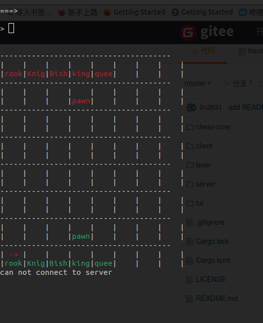

# chess

#### 介绍

chess in rust 
client-server architeture

#### 软件架构

软件架构说明

#### 安装教程

1. 服务端
   cargo run --bin server
2. 客户端
   cargo run --bin client

#### 使用说明

TAB : switch input mode and board mode

input mode : 

    Enter: input buffer

board mode:

- Up:   move up

-  Left: move left

- Right: move right

- Down: move down

- Enter :  First Enter is select , Second Enter is confirm 
  
      
